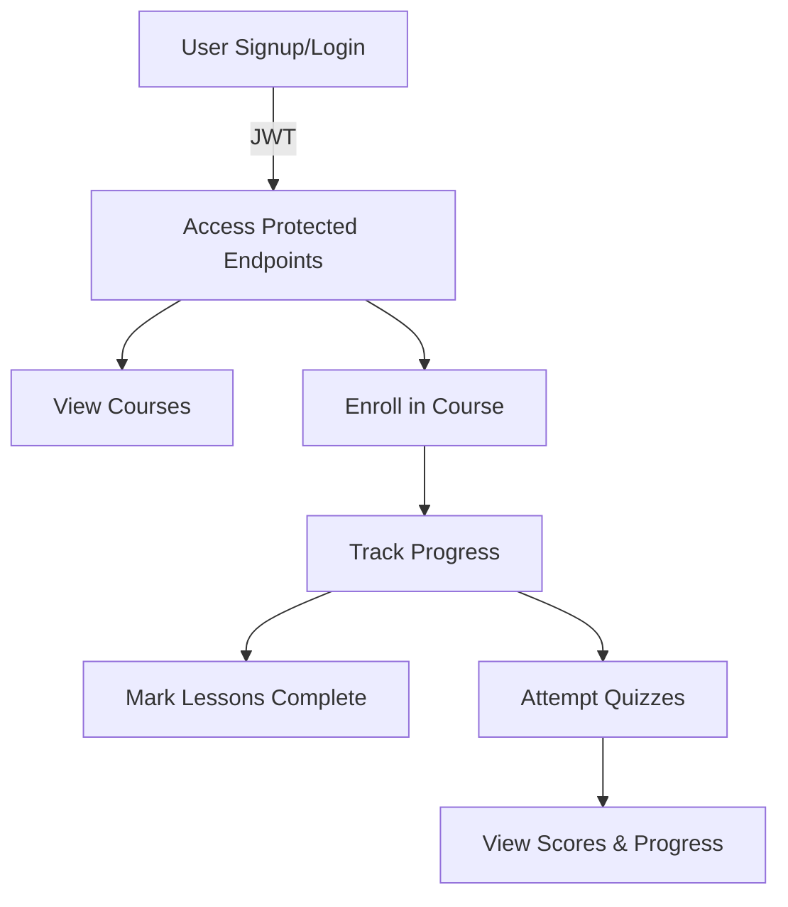
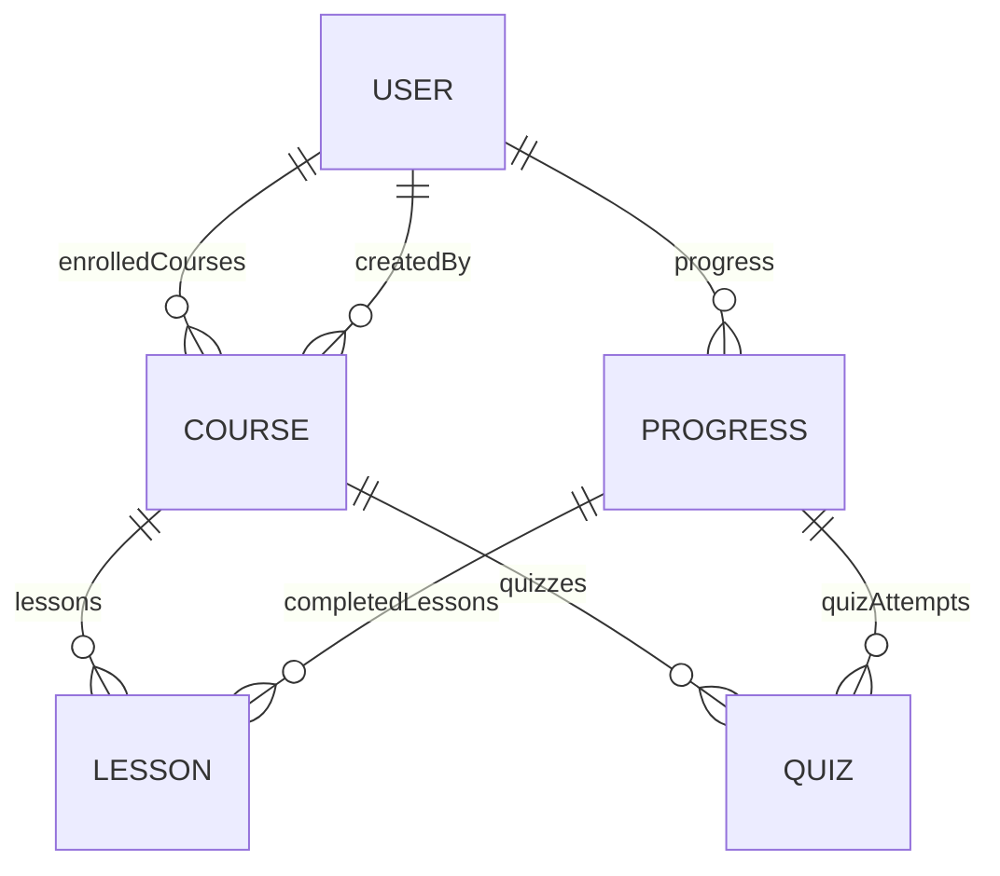

# Learning Management System (LMS) Backend

A Node.js + Express backend for a basic Learning Management System (LMS) with JWT authentication, course management, progress tracking, and more.

---

## Features
- User authentication (JWT-based)
- Admins can create courses, add lessons and quizzes
- Users can view, enroll, and track progress in courses
- Progress tracking for lessons and quizzes
- Pagination for course listing
- Input validation and error handling

---

## Tech Stack
- Node.js, Express
- MongoDB (Mongoose)
- JWT for authentication
- express-validator for input validation

---

## Getting Started

### Prerequisites
- Node.js (v14+)
- MongoDB

### Installation
```bash
npm install
```

### Environment Variables
Create a `.env` file with:
```
MONGODB_URI=your_mongodb_connection_string
JWT_SECRET=your_jwt_secret
```

### Running the Server
```bash
node index.js
```

---

## API Overview

### Authentication
- `POST /auth/signup` — Register a new user
- `POST /auth/login` — Log in and receive a JWT

### Courses
- `POST /courses/` — (Admin) Create a course
- `GET /courses/` — List all courses (paginated)
- `GET /courses/:id` — Get a single course
- `GET /courses/:id/enroll` — Enroll in a course
- `POST /courses/:id/lessons` — (Admin) Add a lesson
- `POST /courses/:id/quizzes` — (Admin) Add a quiz

### Progress
- `POST /progress/lesson` — Mark lesson as complete
- `POST /progress/quiz` — Attempt a quiz
- `GET /progress/:courseId` — Get progress for a course

---

## Example Request: Signup
```bash
curl -X POST http://localhost:3000/auth/signup \
  -H 'Content-Type: application/json' \
  -d '{"username":"john","email":"john@example.com","password":"password123","role":"user"}'
```

---

## Diagrams

### User Flow


### Data Model Relationships


---

## License
MIT 